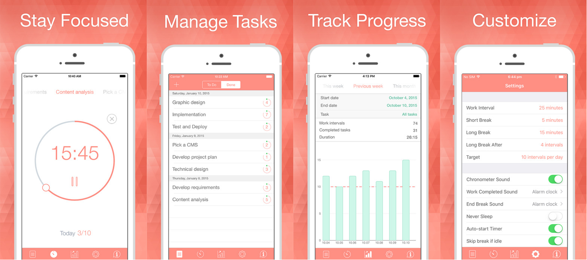

###[Be Focused](http://xwavesoft.com/be-focused-pro-for-iphone-ipad-mac-os-x.html)

Staying on task seems is a real challenge while studying in front of a screen. The [Be Focused App](http://xwavesoft.com/be-focused-pro-for-iphone-ipad-mac-os-x.html) lets you get things done by breaking up individual tasks among discrete intervals, separated by short breaks. It’s a surprisingly effective way to retain motivation and focus. Create tasks, configure breaks and track your progress throughout the day, week or custom period. It's available for [iPhones and iPads](https://itunes.apple.com/us/app/be-focused-focus-timer-goal/id973130201) {++free++} and [Mac](https://itunes.apple.com/app/pomodoro-time-focus-timer/id961632517) {==$1.99==}. 

!!! tip
	Breaks up individual tasks among discrete intervals, separated by short breaks.  
	**Available on** 

_Features of the [Be Focused App](http://xwavesoft.com/be-focused-pro-for-iphone-ipad-mac-os-x.html) on an Apple iPhone_

****

