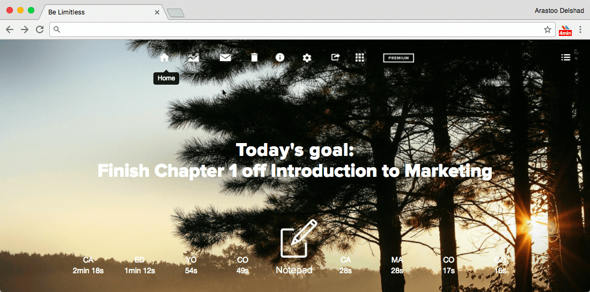

###[Be Limitless](https://chrome.google.com/webstore/detail/be-limitless/jdpnljppdhjpafeaokemhcggofohekbp?hl=en)

[Be Limitless](https://chrome.google.com/webstore/detail/be-limitless/jdpnljppdhjpafeaokemhcggofohekbp?hl=en) turns your browser into a dashboard to easily identify where your time is spent and gives productivity suggestions. The dashboard also includes a smart notepad and a ToDo list section. It's available for [Google Chrome](https://chrome.google.com/webstore/detail/be-limitless/jdpnljppdhjpafeaokemhcggofohekbp?hl=en) {++free++}. 

!!! tip
	Gives you an overview of the time you spend on procrastination websites and the time you actually spend on websites for studying (like Edx or coursera).
	**Available on** 
	
  

_Demonstration of [Be Limitless](https://chrome.google.com/webstore/detail/be-limitless/jdpnljppdhjpafeaokemhcggofohekbp?hl=en) within Google Chrome_

****
