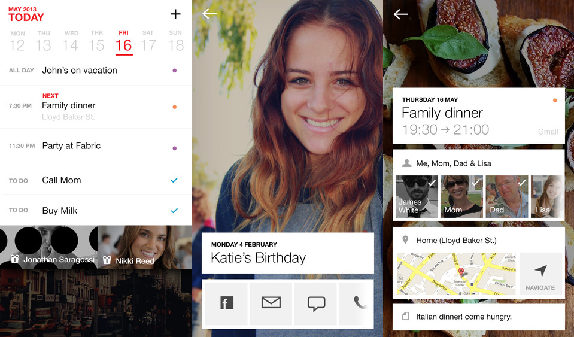

###[Cal Calendar](https://www.any.do/cal/)

The [Cal Calendar](https://www.any.do/cal/) is a calendar app for everyone who is in need of a well-designed calendar with all the standard calendar features. 
It's available for [Android Phones](https://play.google.com/store/apps/details?id=com.anydo.cal&hl=de
) {++free++} and [iPhones](hhttps://itunes.apple.com/us/app/cal-shared-calendar-daily-organizer-weekly-planner/id648287824?mt=8) {++free++}.

!!! tip
	Enables you to schedule your study time within a beautiful app and thereby makes time setting even more fun. 
	**Available on**  and   

_Overview of the [Cal Calendar](https://www.any.do/cal/) features_

****

