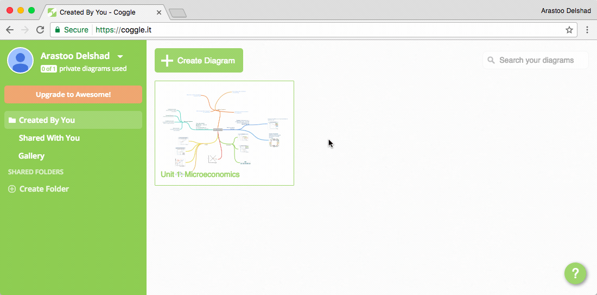

###[Coggle](https://coggle.it/)

[Coggle](https://coggle.it/) is an app that allows you to synthesize your learning into mind maps. 
Mind maps allow you to see where everything fits in and how it relates to other stuff that you are learning. A great practice is to open a mind map and update it every week with the new learned topics. [Coggle](https://coggle.it/) is available for [Google Chrome](https://coggle.it/) {++free++}. 

!!! tip
	Enables you to synthesize your learning into mind maps.
	**Available on** 
	
  

_Demonstration of [Coggle](https://coggle.it/) within Google Chrome_

****
