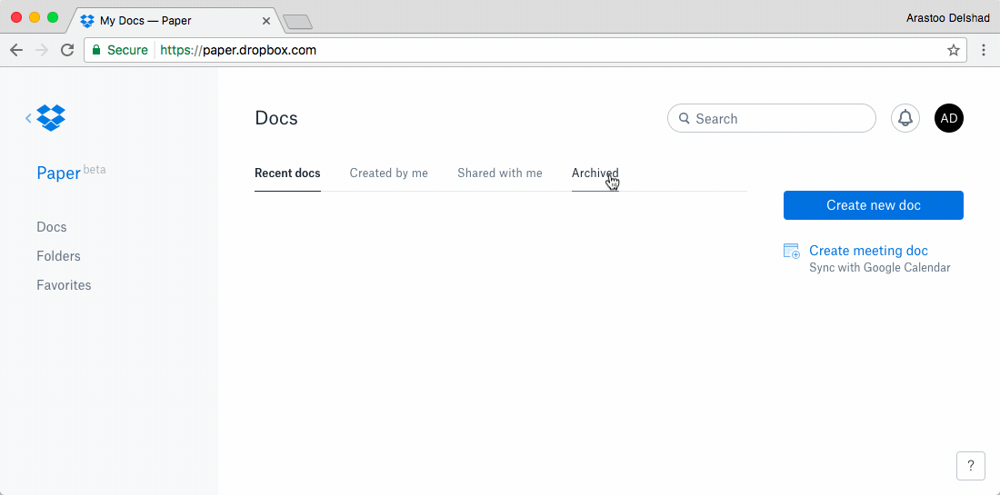

###[Dropbox Paper](https://www.dropbox.com/paper)

[Dropbox Paper](https://www.dropbox.com/paper) is a sleek, minimal text editor that keeps all your docs in the cloud dropbox, no matter where you are right now. [Dropbox Paper](https://www.dropbox.com/paper) lets work on documents with other people simultaneously and easily add multimedia elements to documents (like videos or Google docs). It's available for [Android Phones](https://play.google.com/store/apps/details?id=com.dropbox.paper&hl=en
) {++free++}, [iPhones](https://itunes.apple.com/us/app/dropbox-paper/id1126623662?mt=8
) {++free++} and [Google Chrome](https://www.dropbox.com/paper
) {++free++}. 

!!! tip
	Sleek, minimal text editor that lets you contentrate on taking notes or working on them togehter with fellow students. 
	**Available on**     
	
  

_Demonstration of the [Dropbox Paper](https://www.dropbox.com/paper) App within Google Chrome_

****
