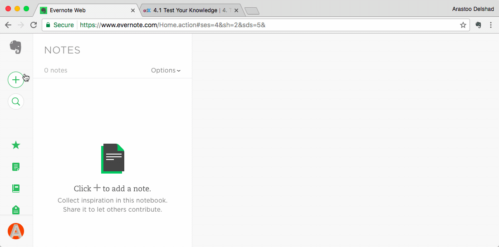

###[Evernote](https://evernote.com/)

[Evernote](https://evernote.com/) lets you take notes, create to-do lists, and save things you find online. It also allows you to include a copy of whole websites [(Evernote Web Clipper)](https://chrome.google.com/webstore/detail/evernote-web-clipper/pioclpoplcdbaefihamjohnefbikjilc?hl=en) within your notes and syncs everything between your phone, tablet, and computer automatically. It's available for [Android Phones](https://play.google.com/store/apps/details?id=com.evernote&hl=en) {++free++}, [iPhones](https://itunes.apple.com/us/app/evernote-stay-organized/id281796108?mt=8
) {++free++} and [Google Chrome](https://evernote.com/) {++free++}. 

!!! tip
	Enables you to write down digital notes wherever you are. **Available on**   

  

_Features of [Evernote](https://evernote.com/) within Google Chrome_

****

