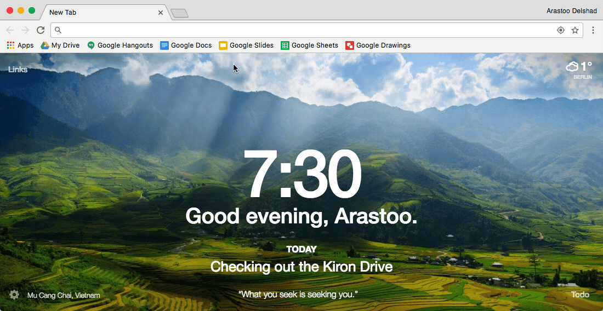

###[Google Apps](https://drive.google.com/)

[Google Apps](https://drive.google.com/) is a bundle of productivity tolls for your online studies. The most important ones are [Google Docs](https://docs.google.com/document/) , [Google Sheets](https://docs.google.com/spreadsheets)  and [Google Slides](https://docs.google.com/presentation/) .  

[Google Docs](https://docs.google.com/document/)  is an online editor that can be used for note taking.  
[Google Sheets](https://docs.google.com/spreadsheets)  is an online spreadsheet tool that can be used to run some basic calculations.  
[Google Slides](https://docs.google.com/presentation/)  is an online presentation tool that can be used to prepare presentation slides for assignments or for sharing them with fellow students. 

[Google Docs](https://docs.google.com/document/)  is available for [Android Phones](https://play.google.com/store/apps/details?id=com.google.android.apps.docs.editors.docs&hl=en) {++free++}, [iPhones](https://itunes.apple.com/us/app/google-docs/id842842640?mt=8
) {++free++} and [Google Chrome](https://docs.google.com/document/
) {++free++}. [Google Sheets](https://docs.google.com/spreadsheets)  is available for for [Android Phones](https://play.google.com/store/apps/details?id=com.google.android.apps.docs.editors.sheets&hl=en
) {++free++}, [iPhones](https://itunes.apple.com/us/app/google-sheets/id842849113?mt=8
) {++free++} and [Google Chrome](https://docs.google.com/spreadsheets
) {++free++}. [Google Slides](https://docs.google.com/presentation/)  is available for for [Android Phones](https://play.google.com/store/apps/details?id=com.google.android.apps.docs.editors.slides&hl=en
) {++free++}, [iPhones](https://itunes.apple.com/us/app/google-slides/id879478102?mt=8
) {++free++} and [Google Chrome](https://docs.google.com/presentation/
) {++free++}. 

!!! tip
	Google Apps are the perfect tool to keep notes on your online studies and store them online no matter where you are.  
	**Available on**     

  

_Features of some [Google Apps](https://drive.google.com/) within Google Chrome_

****

