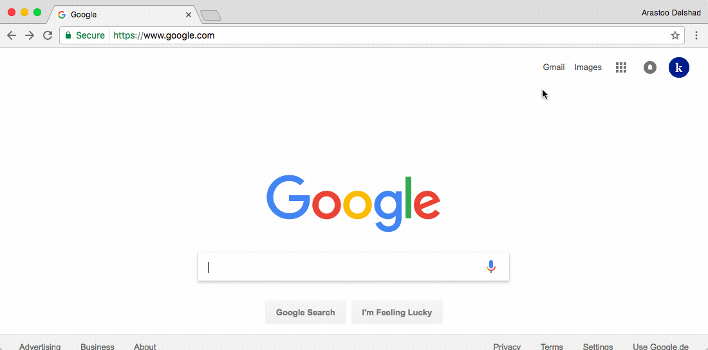

###[Google Calendar](https://www.google.com/calendar)

The [Google Calendar](https://www.google.com/calendar) became by now something like the standard within the world of free digital calendars. It allows you to schedule your personal study times and even invite fellow students to join via [Google Hangout](https://hangouts.google.com/) within your study sessions.  
It's available for [Android Phones](https://play.google.com/store/apps/details?id=com.google.android.calendar&hl=de
) {++free++}, [iPhones](https://itunes.apple.com/us/app/google-calendar-make-the-most-of-every-day/id909319292?mt=8
) {++free++} and [Google Chrome](https://calendar.google.com) {++free++}. 

!!! tip
	Enables you to to schedule your study time in your personal calendar, no matter where you are.  
	**Available on**  and   

_Quick overview on how to use the [Google Calendar](https://www.google.com/calendar)_

****

