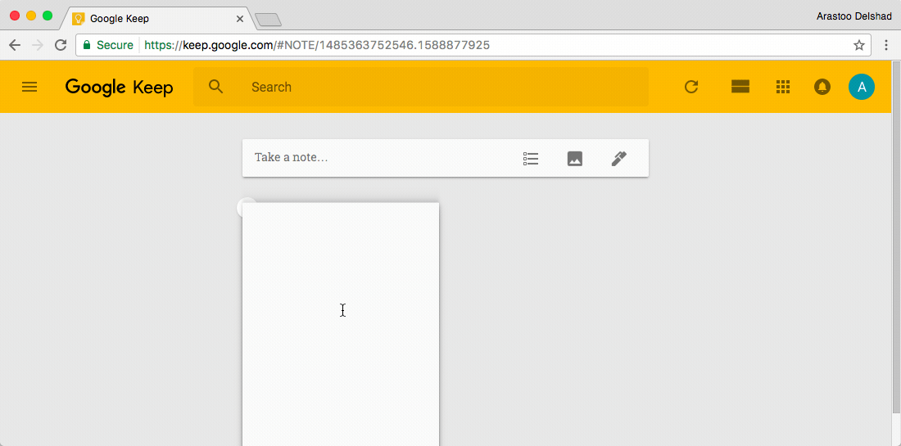

###[Google Keep](https://keep.google.com)

[Google Keep](https://keep.google.com) allows you to make different kinds of notes, including text, lists, images, and audio. You can set time or even location-based reminders. Voice recordings created through [Google Keep](https://keep.google.com) are automatically transcribed. It's available for [Android Phones](https://play.google.com/store/apps/details?id=com.google.android.keep&hl=en
) {++free++}, [iPhones](https://itunes.apple.com/us/app/google-keep-notes-and-lists/id1029207872?mt=8
) {++free++} and [Google Chrome](https://play.google.com/store/apps/details?id=com.google.android.keep&hl=en
) {++free++}. 

!!! tip
	Use Googl Keep to take notes, including text, lists, images, and audio.
	**Available on**   
	
  

_Demonstration of the [Google Keep App](https://keep.google.com) within Google Chrome_

****
