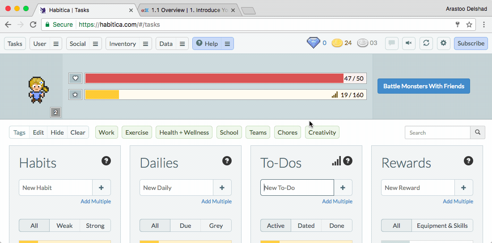

###[Habitica](https://habitica.com/)

Habitica is productivity app that uses a game mechanics overlaid to help you to keep track of and remain motivated to achieve your study goals. It's available for [Android Phones](https://play.google.com/store/apps/details?id=com.habitrpg.android.habitica&hl=en
) {++free++}, [iPhones](https://itunes.apple.com/us/app/habitica-gamified-task-manager/id994882113?mt=8
) {++free++} and [Google Chrome](https://todoist.com/) {++free++}. 
 

!!! tip
	Turns the hard work of accomplishing your learning goals into a game.  
	**Available on**   
  

_Demonstration of how to find a library next to you by using [WorldCat](https://www.worldcat.org/) within Google Chrome_

****

