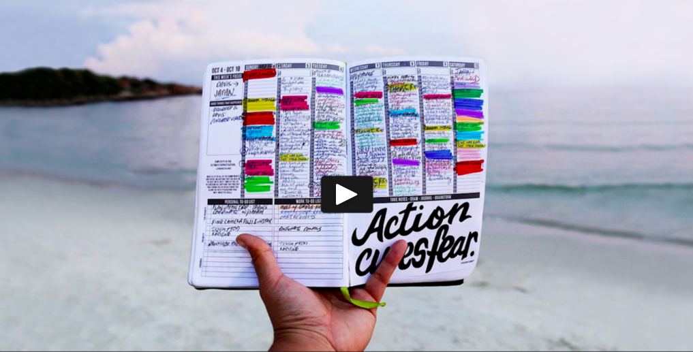

###[Passion Planner](http://www.passionplanner.com/)

Although you are mainly using digital tools while studying online, it could be possible that a paperback calendar might work better for you. If you think so, it's time to check out [Passion Planner](http://www.passionplanner.com/), which is a calendar that can be [downloaded for free](https://static1.squarespace.com/static/52bbd653e4b0525234c48f43/t/58670855be65940ffde9f5e9/1483147359539/A4_2017_Dated_PDF_DL.pdf) or [ordered](http://www.passionplanner.com/shop/) international on a very low budget. 

!!! tip
	[Passion Planner](https://static1.squarespace.com/static/52bbd653e4b0525234c48f43/t/58670855be65940ffde9f5e9/1483147359539/A4_2017_Dated_PDF_DL.pdf) is a calendar that should be checked out by you if you are more a pen and paper person.  

_Quick overview on the development behind [Passion Planner](http://www.passionplanner.com/)_

****

