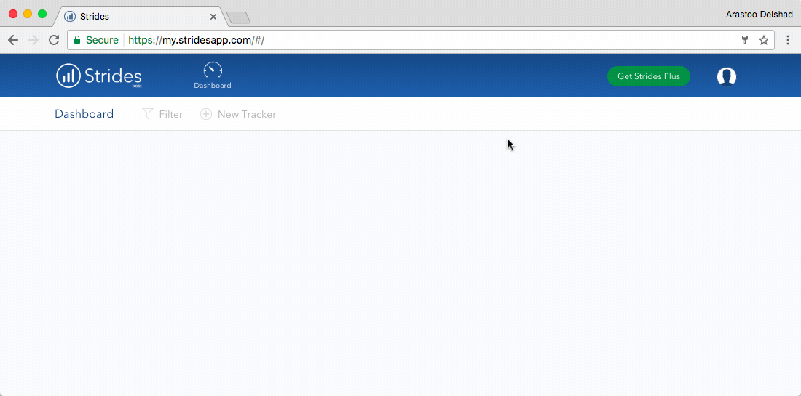

###[Strides](http://www.stridesapp.com/)

[Strides](http://www.stridesapp.com/) lets you track specific goals as well as recurring habits. With regular habits like finishing a online course every day, Strides focuses on your streak of checking in to the habit, and colour codes your progress in green or red to give you an idea of whether you’re on track. It's available for [Android Phones](https://play.google.com/store/apps/details?id=com.evernote&hl=en) {++free++} and [Google Chrome]((http://www.stridesapp.com/)) {++free++}. 

!!! tip
	Tracks your goals and helps you to get yourself into good learning habits.  
	**Available on**   
	
  

_Demonstration of the [Strides](http://www.stridesapp.com/) within Google Chrome_

****
