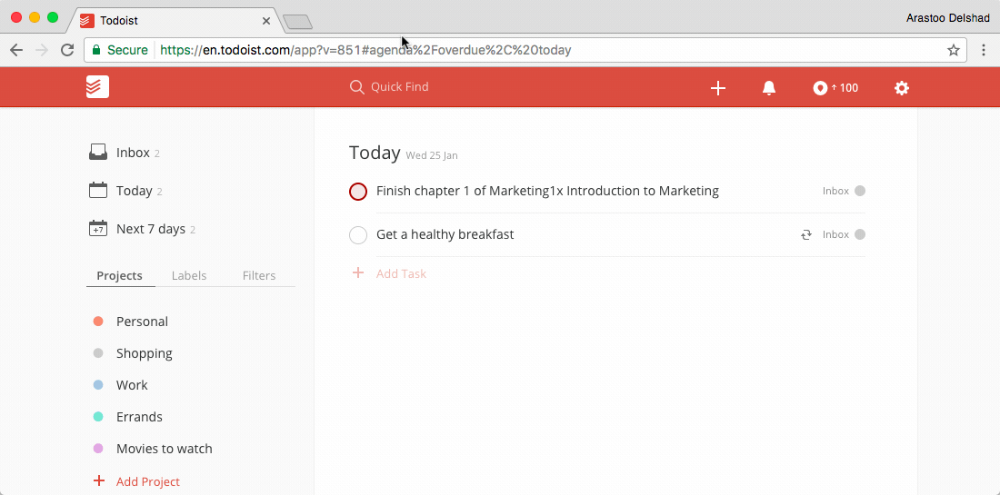

###[Todoist](https://todoist.com/)

Todoist is a project management application for personal productivity. It allows you to manage your tasks from a smartphone, tablet or computer. It's available for [Android Phones](https://play.google.com/store/apps/details?id=com.todoist&hl=en
) {++free++}, [iPhones](https://itunes.apple.com/us/app/todoist-todo-list-for-organizing/id572688855?mt=8
) {++free++} and [Google Chrome](https://todoist.com/) {++free++}. 

!!! tip
	Todoist lets your organize your tasks online from a smartphone, tablet or computer.    
	**Available on**   

	
  

_Demonstration of the [Todoist App](https://todoist.com/) within Google Chrome_

****
