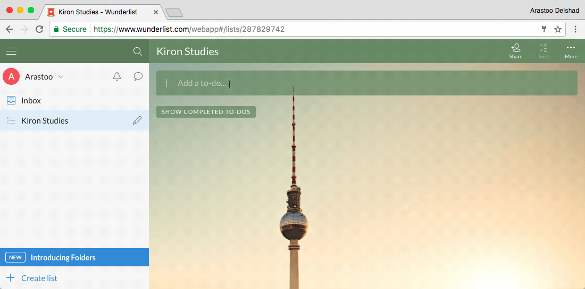

###[Wunderlist](https://www.wunderlist.com/)

Wunderlist allows you to create lists to manage your tasks on nearly any device. Through the "Detail View" you can add due dates (including repeating due dates), reminders, assignees, subtasks, comments, files and notes to tasks. It's available for [Android Phones](https://play.google.com/store/apps/details?id=com.wunderkinder.wunderlistandroid&hl=en
) {++free++}, [iPhones](https://itunes.apple.com/us/app/wunderlist-to-do-list-tasks/id406644151?mt=8
) {++free++} and [Google Chrome](https://todoist.com/) {++free++}. 

!!! tip
	Enables you to keep track of your learning ToDos on nearly every device.  
	**Available on**   

	
  

_Demonstration of [Wunderlist](https://www.wunderlist.com/) within Google Chrome_

****
