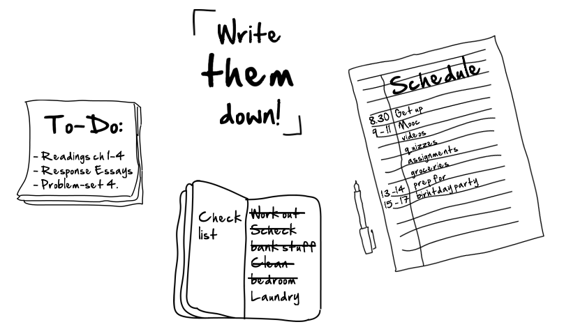

###Creating a focused mind

!!! summary
	Even though you may have the most well lit, quiet and comfortable working space, your mind can still distract you and stop you from finishing your work. It's important to learn some mental techniques that you can use to create motivation, get rid of distraction, and create a balance in your mental space.
	
* [ ] Try to organize all your little thoughts onto paper or on your phone.
* [ ] Create separate to-do lists (e.g. one for your studies, one for your personal life).
* [ ] Cross off each to-do item on your list as this is very satisfying and lets you
know that you’re getting things done!
* [ ] Check out some of our recommended [to-do lists and time management apps](TimeManagementApps.md).

_Overview of different To-Do-Lists_

****