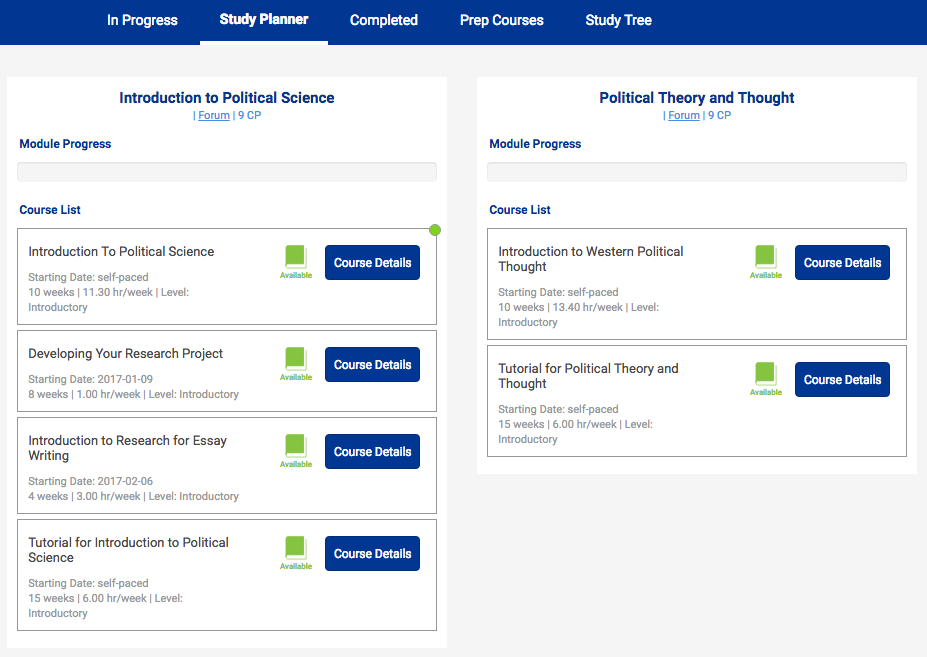

####==Study tracks==
Kiron overs various study tracks from which we recommend you to choose one that fits the best to your interests (e.g. Mechanical Engineering, Political Science, Social Work, Business and Economics, Computer Science, etc.)

!!! tip
	[The graphic below](#graphic-of-the-study-track-political-science) shows the study planner of Political Science.

####==Modules==

Each study track consists of various modules.

!!! tip
	[The graphic below](#graphic-of-the-study-track-political-science) you can see the 2 modules "Introduction to Political Science" and "Political Theory and Thought".

####==Courses==

Each module, on the other hand, consists of various courses.

!!! tip
	[The graphic below](#graphic-of-the-study-track-political-science) that the module "Introduction to Political Science" consists out of "Introduction To Political Science", "Developing Your Research Project", "Introduction to Research for Essay Writing" and a "Tutorial for Introduction to Political Science".

There are mainly 2 different kind of courses:
==Live courses== and ==self-paced courses==.

#####==Live courses==

Live courses start at a specific date and end a specific date. The have ...

* assignments due at a specific time
* readings that you need to keep up with
* and other material that you need to work through as the course moves along.

!!! warning ""
	Weekly hours that you put into these courses are less negotiable because you have to keep up with their schedule.

#####==Self-paced courses==

Self-paced courses do not have a specific date and end a specific date. That means ...

* assignments can be turned in at any time
* and you can work through the material giving it as many hours a week as you would like.

!!! tip
	[The graphic below](#graphic-of-the-study-track-political-science) included the following self-paced courses: Introduction To Political Science, Tutorial for Introduction to Political Science, Introduction to Western Political Thought, Tutorial for Political Theory and Thought

Each course has a specific ...

#####==Length==

Each course has a specific length (e.g. 10 weeks).

#####==Weekly workload==

Each course has a weekly workload which can be used to plan your study time accordingly (e.g. 11,30 hours per week).

#####==University==

Each course is associated with a specific university which provides all the course materials (e.g. Harward).

#####==Classroom landing page==

Each course has its own classroom landing page which offers you a quick overview of the course content (e.g. [this one of the course "Introduction To Political Science"](https://learn.saylor.org/mod/page/view.php?id=460)).

#####Graphic of the study track 'Political Science'

_Overview of two modules including several courses within in the study track of "Political Science"._

****

####==MOOC==

MOOC is an abbreviation for Massive Open Online Courses. MOOCs are aimed at unlimited participation and open access via the web.

####==The Kiron Forum==

[The Kiron Forum](https://forum.kiron.ngo/) is a great place to post your Kiron specific questions and to interact with other Kiron students. [The Kiron Forum](https://forum.kiron.ngo/) team is constantly monitoring the Kiron forum and will respond to your questions as soon as possible.

####==Forums of the MOOC providers==

Forums of the MOOC providers are normally connected to one specific course and offer you the possibility to ...

* get to know other people who have or are also taking the specific course,
* learn why others are interested in the course.

####==Professors==

The professors for online courses still exist. These professors come from many different universities and help to create and then teach the course using their years of expertise and studies in the field.

!!! note
	The professor has a role in teaching the course, but many of the usual roles that a teacher have to be readjusted for online learning.

####==Assessments==

Assessments can be done via [homework](#homework), [quizzes](#quizzes), and [assignments](#assignments). This differs for each class.

#####==Homework==

Homework sometimes will be resources provided to read before, during or after class.

#####==Quizzes==

Quizzes often include activities, multiple choice questions, and poll questions.

#####==Assignments==

Assignments will usually be graded written work that your peers or an instructor in the class will give feedback on and grade.  

****
