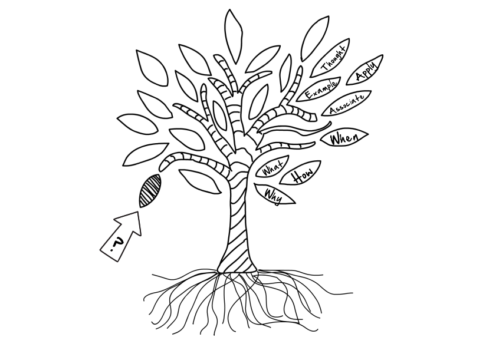

!!! summary
	Effective note-taking from lectures and readings is an essential skill for university study. A good note-taking system helps help you to figure out where the information you have learned should go in your knowledge tree.

When taking note of a new concept, these four questions will help you to gain a basic understand of the concept you are learning:

- ==What?== (definition of a concept)
- ==Why?== (reason why the concept is important)
- ==How?== (how should the concept be used)
- ==When?== (when should the concept be used)

!!! tip
	You can use [this PDF](PDFs/NoteTakingSheet.pdf) every time you are taking note of a new concept.

To gain an even deeper understanding of the concept, keep the following headwords in mind:

- ==Association== (previous things you learned)
- ==Example== (representative example of the concept)
- ==Application== (how to apply the concept in the real world)
- ==Food for thought== (what parts of the concept are inspiring, innovative or might raise an ethical dilemma)

_Visualization of note-taking as a knowledge tree._

****
