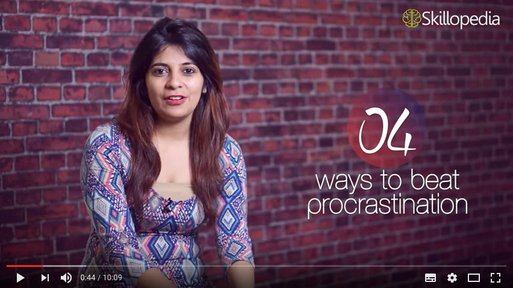
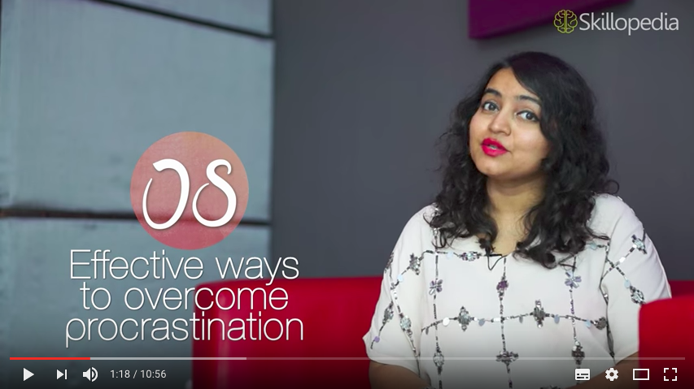

!!! summary
	Procrastination is the avoidance of doing a task that needs to be accomplished. It is the practice of doing more pleasurable things in place of less pleasurable ones, or carrying out less urgent tasks instead of more urgent ones, thus putting off impending tasks to a later time.

You can overcome procrastination by following those 4 tips:

* [ ] ==Just take the first step:== You don't have to see the whole staircase, just take the first step. When you start to look too far, the task just seems to be impossible and you tend to give up at the very beginning.

* [ ] ==Eat the frog first:== Start with the most difficult task first. When you start with the hard jobs first the easy jobs take care of themselves.

* [ ] ==Change your environment:== Different environments have a different impact on your productivity. Look at your work desk, is it too relaxing and makes you want to snuggle in a blanket and sleep. Time to change that!

* [ ] ==Do not wait for the perfect time:== When you set your goals, you need to understand that there is no perfect time to start. Perfectionism is one of the biggest reasons for procrastination.

!!! tip
	Watch/rewatch the follwing [Skillopedia](https://www.youtube.com/channel/UCC3UrdqNf6rpWZoTiYbYk4A) videos to refresh your understanding fo procrastination and how to eliminate it.

_[Skillopedia](https://www.youtube.com/channel/UCC3UrdqNf6rpWZoTiYbYk4A) video with 4 ways to beat procrastination_

_[Skillopedia](https://www.youtube.com/channel/UCC3UrdqNf6rpWZoTiYbYk4A) video about 8 effective ways to overcome procrastination by using time management skills_

****
