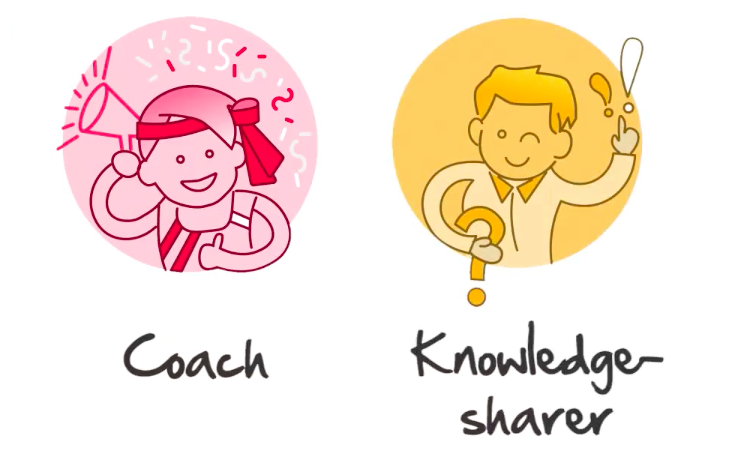

!!! summary
	Your community - those who are around you and who support you and those who are on the same journey as you are, also create a third space for you to work within while you are studying with Kiron.
	
	
In a traditional classroom used to be your encourager and your guider. They would

- help walk students through knowledge,
- answers questions,
- and challenge students to engage with the material.

Now, you will need to take accountability for this role yourself and find out how you can
use the communities already in place around you to your maximum benefit.
  

_Connect with the student community around you, so that they can become your Coach and Knowledge-sharer as well._

****

###Family and friends

!!! summary
	Your friends and family are also an important part of your learning community.

We recommend you to ...

* [ ] have an open conversation about Kiron
* [ ] and your goals while studying with Kiron.  
	
****
