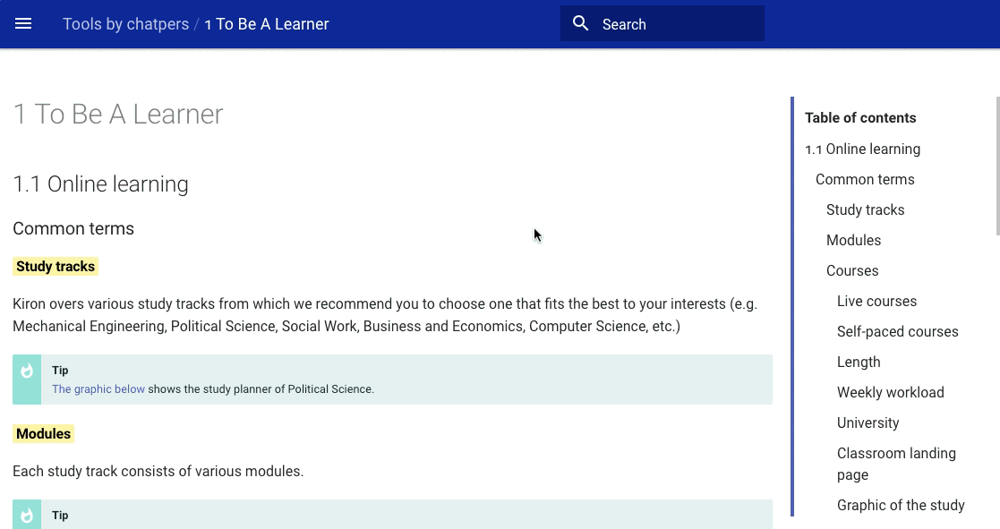

#The Kiron eLearning Toolbox

Within this toolbox you will find a collection of useful tips and tools on how to become an online learner. This toolbox is based on a online course produced by [Kiron - Open Higher Education for Refugees](https://kiron.ngo/) and the [Minerva Schools at KGI](https://www.minerva.kgi.edu/).

!!! note
	Use the search function to find the tools you are looking for or navigation through the toolbox based on the chapters of our course, as shown below.

