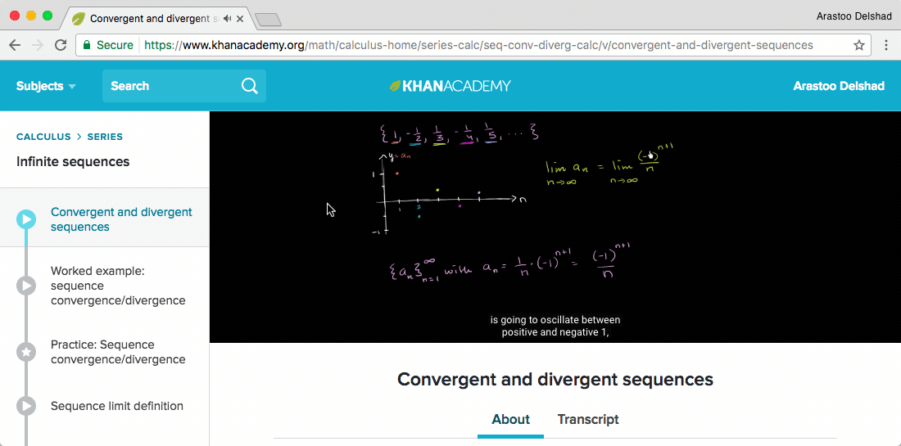
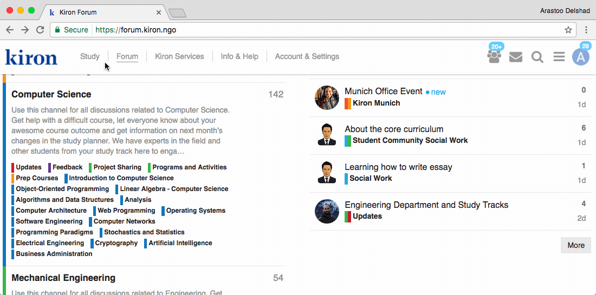

# Welcome to the Tool Box
This is a pretty awesome documentation tool to be used for our KironX Tool Box. Isn't it?

[mkdocs.org](http://mkdocs.org)

Editing is continuing.

{!extensions/TBD.md!}

## Commands

* `mkdocs new [dir-name]` - Create a new project.
* `mkdocs serve` - Start the live-reloading docs server.
* `mkdocs build` - Build the documentation site.
* `mkdocs help` - Print this help message.

## Project layout

    mkdocs.yml    # The configuration file.
    docs/
        index.md  # The documentation homepage.
        ...       # Other markdown pages, images and other files.
        
## This is another Title

## Blended Learning

What's blended learning? #TBD

**a) Use the MOOC’s own Forum** and discuss anything there to connect with all the other learners from around the world.

_Discussion forum of an [Edx](https://edx.org) course_

****

**b) Use discussion Websites** ask any question and discuss with online learners. :shit: 

* [Brainly](https://brainly.com/) educational questions and answers forum. Ask any question and get answers to any topic.
* [Quora](https://www.quora.com/) and [Reddit](https://www.reddit.com/) the leading questions & answers website. Its users are very active, so you can ask anything and get answers quite quickly normally.
* [Khan Academy](https://www.khanacademy.org/) for some topics, you may try looking for external resources with more materials and discussions. For example, Khan Academy would have videos about almost anything in `math` and `sciences` and a discussion below each video where you can ask anything or see previous answers.

_Discussion forum of a [Khan Academy](https://www.khanacademy.org/) video_

****

**c) Ask Kiron for help!** The Kiron Team is alsways there for you during your studies.

* [Student Support](mailto:student-support@kiron.ngo) can be conteacted on the [Kiron Campus](https://campus.kiron.ngo/) or via mail: [student-support@kiron.ngo](mailto:student-support@kiron.ngo)
* [Kiron Online Study Groups](https://forum.kiron.ngo/) offer you the possibility to study online with other Kiron students. This can be a valuable resourse for getting help from fellow students who might have stumbled accross the same problems as you have.  
* [Kiron Services](https://campus.kiron.ngo/app/services) offer a variety of ways to get help. Visit the [Kiron Campus](https://campus.kiron.ngo/) to find out more about and to sign up for specific services.
* [The Kiron Forum](https://forum.kiron.ngo/) can be used to get answers from various Kiron students. The Kiron Student Support is also reguarly monitoring the Forum. Feel free to aks your questions there. 

_Ouick overview of [the Kiron Forum](https://forum.kiron.ngo/)_

****

lökö

ask any question and discuss with online learners. :shit: 

Kiron Can Help:

!!! Bla
    Lorem ipsum dolor sit amet, consectetur adipiscing elit. Nulla et euismod
    nulla. Curabitur feugiat, tortor non consequat finibus, justo purus auctor
    massa, nec semper lorem quam in massa.

* Unordered sub-list. 

-Brainly.com - educational questions and answers forum. Ask any question and get answers to any topic

	sdfdf
	sdfsdf

<video width="320" height="240" controls>
  <source src="movie.mp4" type="video/mp4">
  <source src="movie.ogg" type="video/ogg">
Your browser does not support the video tag.
</video>

<iframe src="https://www.google.com/maps/d/embed?mid=16Csc1LfPwufU1IyFpz7MXZRlcCo" width="640" height="480"></iframe>